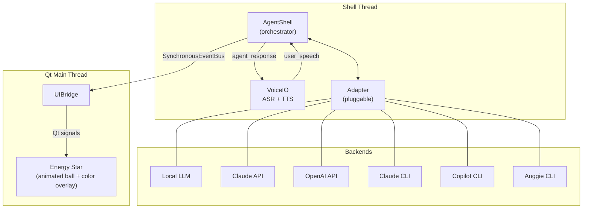

# AgentOPTI v2

A voice-driven AI assistant with a visual interface. Speak to it, it speaks back — powered by swappable AI backends (local LLMs, Claude, OpenAI, CLI agents) and an animated Energy Star ball that reflects the agent's state through color and motion.

## What It Does

AgentOPTI listens for speech via offline ASR (Vosk), routes it to the active AI backend, streams the response through text cleaning, and speaks it back via TTS — all while an animated ball visualizes what's happening (thinking, speaking, calling tools, idle). You can interrupt the agent mid-sentence by speaking over it.

## Architecture



### Modules

| Directory | Purpose |
|-----------|---------|
| `src/core/` | Config, EventBus, AgentShell orchestrator |
| `src/adapter/` | AgentAdapter ABC + backends (local LLM, Claude API, OpenAI, Claude CLI, Copilot CLI, Auggie CLI) |
| `src/voice/` | VoiceIO — ASR (Vosk) + TTS (pyttsx3/pygame) with interruptible playback |
| `src/speech/` | ASRx worker and SpeechRecognizer |
| `src/energy/` | Energy Star ball UI — Qt widget, video player, color overlay, animations |
| `src/ui/` | UIBridge — event bus to Qt signal adapter |
| `src/llm/` | LlamaCppServer + inference manager for local models |
| `src/utils/` | AppLogger, TextCleaner, Folders, WorkerThread |
| `src/constants/` | Precompiled regex patterns |

## Adapters

Backends are pluggable via the `AgentAdapter` ABC. Each implements `send()` (streaming generator), `stop()` (interrupt), and `is_available()` (health check). Available adapters:

| Adapter | Backend | Requires |
|---------|---------|----------|
| `local_llm` | Local llama.cpp model | Model files on disk |
| `claude` | Claude API | `anthropic` package + API key |
| `openai` | OpenAI API | `openai` package + API key |
| `claude_cli` | Claude Code CLI | `claude` on PATH + `claude-agent-sdk` |
| `copilot_cli` | GitHub Copilot CLI | `copilot` on PATH + SDK |
| `auggie_cli` | Auggie CLI | `auggie` on PATH + SDK |

The active adapter can be switched at runtime via the event bus.

## Requirements

- Python 3.12
- PySide6 (Qt UI)
- Vosk (offline speech recognition)
- pyttsx3 + pygame (TTS with interruptible playback)
- mistune + beautifulsoup4 (text cleaning pipeline)

## Running

```bash
cd C:\development\opti
python src/main.py
```

## Key Design Decisions

- **Engine-per-utterance TTS** — fresh pyttsx3 engine per text to avoid the Windows SAPI5 hang bug
- **save_to_file + pygame** — TTS renders to file, pygame plays it back so the user can interrupt by speaking over the agent
- **SynchronousEventBus** — pure threaded pub/sub, callbacks execute in the publisher's thread
- **Qt aboutToQuit** — background threads stop before Qt destroys widgets, preventing crash-on-exit
- **TextCleaner pipeline** — markdown → HTML → text → emojis → whitespace (mistune + bs4)
- **Async task cancellation** — CLI adapters use `asyncio.Task.cancel()` across threads for clean interruption of SDK async generators (avoids anyio cancel scope errors)
