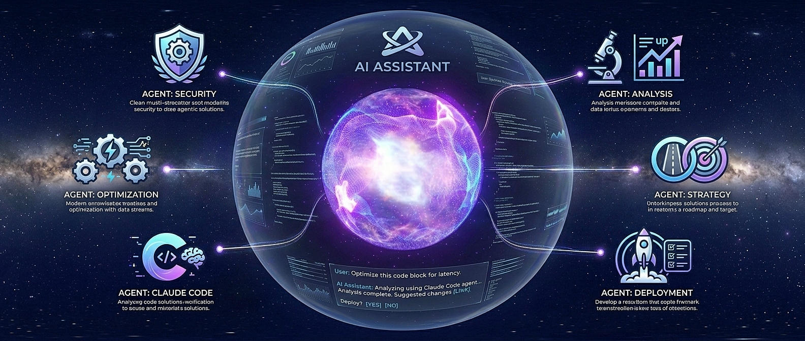
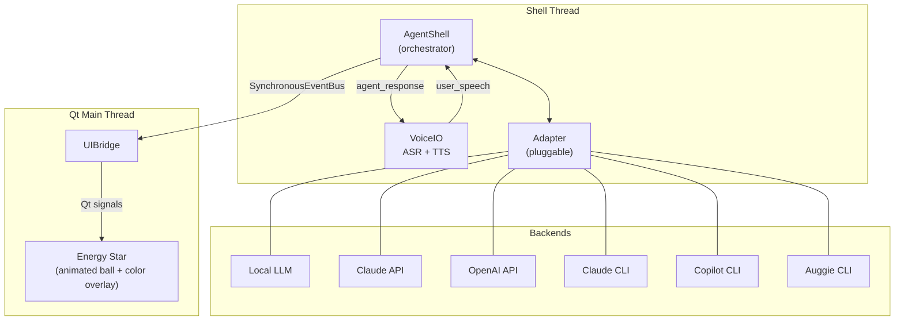

# AgentOPTI v2

A voice-driven AI assistant with a visual interface. Speak to it, it speaks back — powered by swappable AI backends (local LLMs, Claude, OpenAI, CLI agents) and an animated Energy Star ball that reflects the agent's state through color and motion.

## What It Does

OPTI listens for speech via faster-whisper (CUDA/CPU), routes it to the active AI backend, streams the response through text cleaning, and speaks it back via TTS — all while an animated ball visualizes what's happening (thinking, speaking, calling tools, idle). You can interrupt the agent mid-sentence by speaking over it.

## Architecture



### Modules

| Directory | Purpose |
|-----------|---------|
| `src/core/` | Config, EventBus, AgentShell orchestrator |
| `src/adapter/` | AgentAdapter ABC + backends (local LLM, Claude API, OpenAI, Claude CLI, Copilot CLI, Auggie CLI) |
| `src/voice/` | VoiceIO — ASR (faster-whisper) + TTS (pyttsx3/pygame) with interruptible playback |
| `src/speech/` | SpeechRecognizer and ASRx worker |
| `src/energy/` | Energy Star ball UI — Qt widget, video player, color overlay, animations |
| `src/ui/` | UIBridge — event bus to Qt signal adapter |
| `src/llm/` | LlamaCppServer + inference manager for local models |
| `src/utils/` | AppLogger, TextCleaner, Folders, WorkerThread |
| `src/constants/` | Precompiled regex patterns |

## Adapters

Backends are pluggable via the `AgentAdapter` ABC. Each implements `send()` (streaming generator), `stop()` (interrupt), and `is_available()` (health check).

| Adapter | Backend | Model | Requires |
|---------|---------|-------|----------|
| `local_llm` | llama.cpp (local) | Qwen3-0.6B (GGUF) | Model file in `models/` |
| `claude` | Anthropic API | claude-sonnet-4-20250514 | `ANTHROPIC_API_KEY` + `pip install anthropic` |
| `openai` | OpenAI API | gpt-4o | `OPENAI_API_KEY` + `pip install openai` |
| `claude_cli` | Claude Code CLI | — | `claude` on PATH + `pip install claude-agent-sdk` |
| `copilot_cli` | GitHub Copilot CLI | — | `copilot` on PATH + SDK |
| `auggie_cli` | Augment CLI | — | `auggie` on PATH + `pip install auggie-sdk` *(experimental)* |

The active adapter is set in `src/core/config.py` and can be switched at runtime via the event bus.

## Setup

### Prerequisites

- **Python 3.12** (exact major version — `requires-python = "==3.12.*"`)
- **Windows** (tested on Windows 11 — TTS uses SAPI5 voices)
- **Microphone** for speech input
- **NVIDIA GPU** recommended for ASR (faster-whisper falls back to CPU automatically)

### 1. Clone and create virtual environment

```bash
git clone https://github.com/your-org/opti.git
cd opti

python -m venv .venv
.venv\Scripts\activate
```

### 2. Install dependencies

```bash
# Core (ASR, TTS, UI, text processing)
pip install -e .

# Cloud API adapters (Claude and/or OpenAI)
pip install -e ".[cloud]"
```

Core dependencies installed: `PySide6`, `pyttsx3`, `pyaudio`, `pygame`, `faster-whisper`, `mistune`, `beautifulsoup4`, `requests`.

### 3. Environment variables

Set API keys as environment variables (or fill them directly in `src/core/config.py` under `CloudConfig`):

```bash
# For Claude API adapter
set ANTHROPIC_API_KEY=sk-ant-...

# For OpenAI adapter
set OPENAI_API_KEY=sk-...
```

Add these to your shell profile or a `.env` loader if you want them persistent.

### 4. ASR model

faster-whisper downloads the model automatically on first run. Default model is `base.en`. No manual download needed.

### 5. Select the active adapter

Edit `src/core/config.py`:

```python
active_adapter: str = "claude_cli"  # "local_llm" | "claude" | "openai" | "claude_cli" | "copilot_cli" | "auggie_cli"
```

### 6. CLI adapters (optional)

**Claude CLI** — install [Claude Code](https://docs.anthropic.com/en/docs/claude-code) so `claude` is on PATH, then:
```bash
pip install claude-agent-sdk
```

**Copilot CLI** — install GitHub Copilot CLI so `copilot` is on PATH, then install its SDK.

**Auggie CLI** — install Augment CLI so `auggie` is on PATH, then:
```bash
pip install auggie-sdk
```
> Note: auggie-sdk on Windows may return empty responses — consider this experimental.

### 7. Local LLM (optional)

Download a GGUF model and place it in `models/`. Then set `InferenceConfig.model_name` in `src/core/config.py` to match the filename (without extension).

## Running

```bash
python src/main.py
```

## Key Design Decisions

- **Engine-per-utterance TTS** — fresh pyttsx3 engine per text to avoid the Windows SAPI5 hang bug
- **save_to_file + pygame** — TTS renders to file, pygame plays it back so the user can interrupt by speaking over the agent
- **faster-whisper ASR** — CUDA-accelerated transcription with CPU fallback; outputs punctuated text natively
- **SynchronousEventBus** — pure threaded pub/sub, callbacks execute in the publisher's thread
- **Qt aboutToQuit** — background threads stop before Qt destroys widgets, preventing crash-on-exit
- **TextCleaner pipeline** — markdown → HTML → text → emojis → whitespace (mistune + bs4)
- **Async task cancellation** — CLI adapters use `asyncio.Task.cancel()` across threads for clean interruption of SDK async generators
